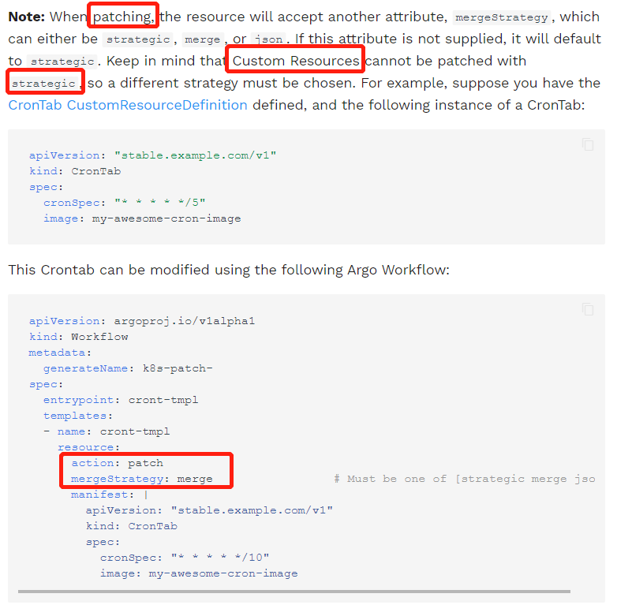
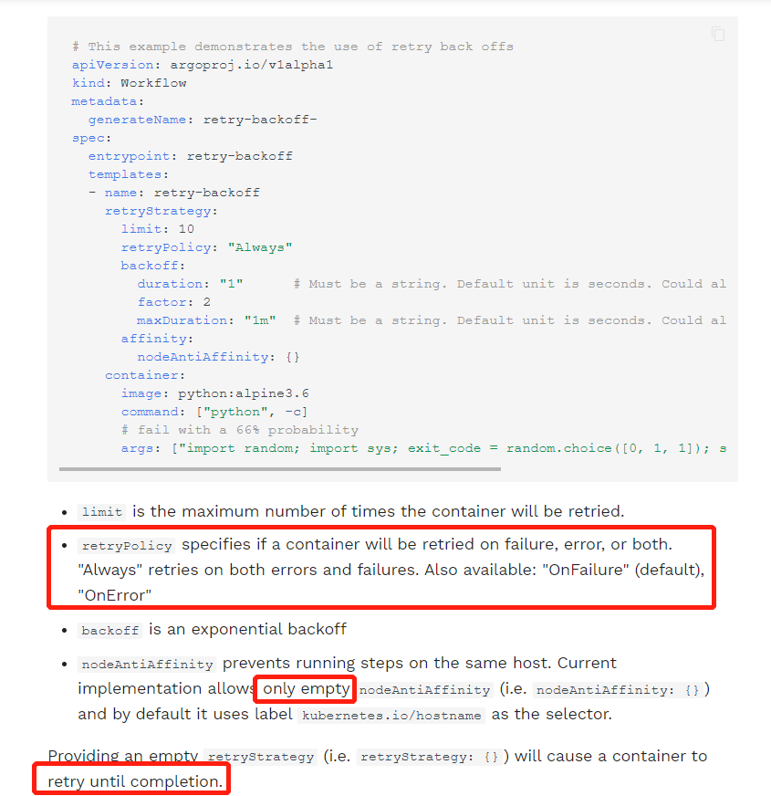

* CR can not be patched with strategic



* argo built-in support for git, http, gcs and s3 artifacts

  ```yaml
  apiVersion: argoproj.io/v1alpha1
  kind: Workflow
  metadata:
    generateName: hardwired-artifact-
  spec:
    entrypoint: hardwired-artifact
    templates:
    - name: hardwired-artifact
      inputs:
        artifacts:
        # Check out the master branch of the argo repo and place it at /src
        # revision can be anything that git checkout accepts: branch, commit, tag, etc.
        - name: argo-source
          path: /src
          git:
            repo: https://github.com/argoproj/argo-workflows.git
            revision: "master"
        # Download kubectl 1.8.0 and place it at /bin/kubectl
        - name: kubectl
          path: /bin/kubectl
          mode: 0755
          http:
            url: https://storage.googleapis.com/kubernetes-release/release/v1.8.0/bin/linux/amd64/kubectl
        # Copy an s3 compatible artifact repository bucket (such as AWS, GCS and Minio) and place it at /s3
        - name: objects
          path: /s3
          s3:
            endpoint: storage.googleapis.com
            bucket: my-bucket-name
            key: path/in/bucket
            accessKeySecret:
              name: my-s3-credentials
              key: accessKey
            secretKeySecret:
              name: my-s3-credentials
              key: secretKey
      container:
        image: debian
        command: [sh, -c]
        args: ["ls -l /src /bin/kubectl /s3"]
  ```

* 主容器等待sidecar拉起

  ```yaml
  apiVersion: argoproj.io/v1alpha1
  kind: Workflow
  metadata:
    generateName: sidecar-nginx-
  spec:
    entrypoint: sidecar-nginx-example
    templates:
    - name: sidecar-nginx-example
      container:
        image: appropriate/curl
        command: [sh, -c]
        # Try to read from nginx web server until it comes up
        args: ["until `curl -G 'http://127.0.0.1/' >& /tmp/out`; do echo sleep && sleep 1; done && cat /tmp/out"]
      # Create a simple nginx web server
      sidecars:
      - name: nginx
        image: nginx:1.13
  ```

* > The big advantage of daemons compared with sidecars is that their existence can persist across multiple steps or even the entire workflow.

* interesting loop

  ```yaml
  apiVersion: argoproj.io/v1alpha1
  kind: Workflow
  metadata:
    generateName: loops-maps-
  spec:
    entrypoint: loop-map-example
    templates:
    - name: loop-map-example
      steps:
      - - name: test-linux
          template: cat-os-release
          arguments:
            parameters:
            - name: image
              value: "{{item.image}}"
            - name: tag
              value: "{{item.tag}}"
          withItems:
          - { image: 'debian', tag: '9.1' }       #item set 1
          - { image: 'debian', tag: '8.9' }       #item set 2
          - { image: 'alpine', tag: '3.6' }       #item set 3
          - { image: 'ubuntu', tag: '17.10' }     #item set 4
  
    - name: cat-os-release
      inputs:
        parameters:
        - name: image
        - name: tag
      container:
        image: "{{inputs.parameters.image}}:{{inputs.parameters.tag}}"
        command: [cat]
        args: [/etc/os-release]
  ```

  ```yaml
  apiVersion: argoproj.io/v1alpha1
  kind: Workflow
  metadata:
    generateName: loops-param-arg-
  spec:
    entrypoint: loop-param-arg-example
    arguments:
      parameters:
      - name: os-list                                     # a list of items
        value: |
          [
            { "image": "debian", "tag": "9.1" },
            { "image": "debian", "tag": "8.9" },
            { "image": "alpine", "tag": "3.6" },
            { "image": "ubuntu", "tag": "17.10" }
          ]
  
    templates:
    - name: loop-param-arg-example
      inputs:
        parameters:
        - name: os-list
      steps:
      - - name: test-linux
          template: cat-os-release
          arguments:
            parameters:
            - name: image
              value: "{{item.image}}"
            - name: tag
              value: "{{item.tag}}"
          withParam: "{{inputs.parameters.os-list}}"      # parameter specifies the list to iterate over
  
    # This template is the same as in the previous example
    - name: cat-os-release
      inputs:
        parameters:
        - name: image
        - name: tag
      container:
        image: "{{inputs.parameters.image}}:{{inputs.parameters.tag}}"
        command: [cat]
        args: [/etc/os-release]
  ```

  ```yaml
  apiVersion: argoproj.io/v1alpha1
  kind: Workflow
  metadata:
    generateName: loops-param-result-
  spec:
    entrypoint: loop-param-result-example
    templates:
    - name: loop-param-result-example
      steps:
      - - name: generate
          template: gen-number-list
      # Iterate over the list of numbers generated by the generate step above
      - - name: sleep
          template: sleep-n-sec
          arguments:
            parameters:
            - name: seconds
              value: "{{item}}"
          withParam: "{{steps.generate.outputs.result}}"
  
    # Generate a list of numbers in JSON format
    - name: gen-number-list
      script:
        image: python:alpine3.6
        command: [python]
        source: |
          import json
          import sys
          json.dump([i for i in range(20, 31)], sys.stdout)
  
    - name: sleep-n-sec
      inputs:
        parameters:
        - name: seconds
      container:
        image: alpine:latest
        command: [sh, -c]
        args: ["echo sleeping for {{inputs.parameters.seconds}} seconds; sleep {{inputs.parameters.seconds}}; echo done"]
  ```

* retrying failed or errored steps

  

* 